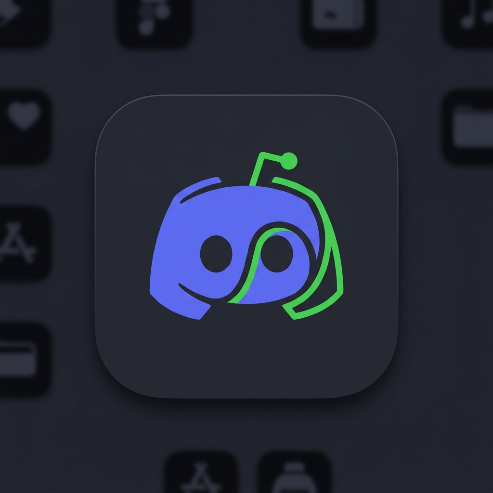

# Swipecord ⚡️

<div align="center">
  
  <p><strong>Discord sunucularını Tinder gibi kaydırarak düzenleyin.</strong></p>
  
  [](https://opensource.org/licenses/MIT)
  []()
  [-yellow.svg)]()
</div>

<br>

Swipecord, kalabalık Discord sunucu listenizi temizlemeyi Tinder benzeri eğlenceli bir deneyime dönüştüren, macOS tasarım dilinden ilham almış premium bir Electron masaüstü uygulamasıdır.

Diğer diller: [English](README.md)

---

## ✨ Özellikler

- **Tinder Tarzı Kaydırma:** Çıkmak için sola, kalmak için sağa kaydırın.
- **Toplu İşlem:** Tüm seçimleriniz sıraya alınır. İşiniz bittiğinde hepsini tek seferde onaylayıp uygulayabilirsiniz.
- **Geri Alma (Undo):** Yanlışlıkla mı kaydırdınız? `Geri Al` butonuna veya `Ctrl+Z`'ye basarak işleminizi geri alın.
- **Kurucu Koruması:** Sahibi olduğunuz sunuculardan yanlışlıkla çıkmanızı engeller.
- **Premium Arayüz:** Frosted glass (buzlu cam) efektleri, akıcı fizik tabanlı animasyonlar ve macOS traffic-light butonları.
- **Klavye Kısayolları:** Hızlı kullanım için tam klavye desteği (Yön Tuşları, A/D, Ctrl+Z).
- **%100 Yerel ve Güvenli:** Discord token'ınız bilgisayarınızın dışına asla çıkmaz. [Gizlilik Politikamızı](PRIVACY_POLICY.md) okuyun.

## 🚀 Kurulum ve Kullanım

1. **Repoyu klonlayın:**
   ```bash
   git clone https://github.com/mertcan-alan/swipecord.git
   cd swipecord
   ```

2. **Bağımlılıkları yükleyin:**
   ```bash
   npm install
   ```

3. **Uygulamayı başlatın:**
   ```bash
   npm start
   ```

## 🔑 Discord Token Nasıl Alınır?

*Not: Swipecord tamamen kişisel ve yerel kullanım içindir. Token'ınızı asla kimseyle paylaşmayın.*

1. Tarayıcınızdan veya masaüstü uygulamasından Discord'u açın.
2. `Ctrl + Shift + I` (veya `F12`) tuşlarına basarak Geliştirici Seçeneklerini (DevTools) açın.
3. **Network (Ağ)** sekmesine geçin.
4. Herhangi bir kanala veya sunucuya tıklayarak ağ akışı oluşturun.
5. İstekler arasında `science` veya `messages` kelimesini aratın.
6. Bir isteğe tıklayın, sağ taraftaki **Headers (Başlıklar)** kısmından aşağıya, **Request Headers** bölümüne inin.
7. `Authorization` başlığını bulun. Karşısındaki değer sizin token'ınızdır.

## ⌨️ Kısayollar

| İşlem | Tuş |
| :--- | :--- |
| **Sunucudan Ayrıl** | `Sola Kaydır` / `Sol Yön Tuşu` / `A` |
| **Sunucuda Kal** | `Sağa Kaydır` / `Sağ Yön Tuşu` / `D` |
| **Geri Al** | `Geri Al Butonu` / `Ctrl + Z` |

## 🛡️ Güvenlik ve Gizlilik

Swipecord standart Electron güvenlik önlemlerini kullanır. Renderer sürecinde `nodeIntegration` kapalıdır ve `contextIsolation` zorunludur. Token'ınız sadece uygulama çalıştığı sürece bellekte (RAM) tutulur; hiçbir şekilde **diske kaydedilmez** veya **üçüncü parti bir sunucuya gönderilmez**.

## 📄 Lisans

Bu proje MIT Lisansı altında lisanslanmıştır - detaylar için [LICENSE](LICENSE) dosyasına bakabilirsiniz.
